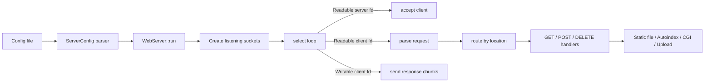

# webserv (42 School)

An HTTP/1.1 web server written from scratch in C++98 using sockets + select, built as part of the 42 cursus.


-green)


## Table of contents

1. [What this project is](#what-this-project-is)
2. [Implemented features](#implemented-features)
3. [Architecture](#architecture)
4. [Build and run](#build-and-run)
5. [Configuration file reference](#configuration-file-reference)
6. [HTTP behavior and status codes](#http-behavior-and-status-codes)
7. [CGI and upload flow](#cgi-and-upload-flow)
8. [Project structure](#project-structure)
9. [Testing guide](#testing-guide)
10. [Known limits and notes](#known-limits-and-notes)
11. [Resources](#resources)

## What this project is

The goal of 42 webserv is to reproduce the core behavior of a real web server:

- Accept many clients at the same time without threads.
- Parse HTTP requests and generate valid HTTP/1.1 responses.
- Serve static files and directories.
- Execute CGI scripts for dynamic content.
- Handle uploads, errors, redirections, and per-location rules from a config file.

This repository implements that with:

- A single-process event loop around select.
- One Server object per host:port listening endpoint.
- One Client state machine per connected socket.
- Config-driven routing inspired by Nginx-like server/location blocks.

## Implemented features

### Core networking

- TCP server sockets using AF_INET + SOCK_STREAM.
- Multiplexing with select() for read/write readiness.
- Keep-alive handling and connection timeout cleanup.

### HTTP layer

- Methods: GET, POST, DELETE.
- Request-line + header parsing with validation.
- URI sanitization/protection against path traversal patterns.
- Chunked transfer decoding for incoming bodies.
- Chunked transfer encoding for outgoing body streaming.

### Routing and configuration

- Multiple virtual servers on same host with different ports and serverName values.
- Per-location directives:
	- allowedMethods
	- root or alias
	- index
	- autoIndex
	- redirection
	- cgi
	- canUpload
- Per-server error_page and body-size limit.

### Content serving

- Static file serving with MIME type mapping.
- Directory index resolution (index files).
- Autoindex HTML listing when enabled.
- Recursive directory deletion for DELETE on directories.

### CGI and uploads

- CGI execution via fork + execve.
- Script mapping by extension (example: .py, .php).
- CGI environment variables, including HTTP_COOKIE propagation.
- Upload support for regular and multipart bodies.
- Temporary files and cleanup lifecycle for request/CGI processing.

### Error handling

Includes dedicated pages for:

- 201, 400, 403, 404, 405, 408, 409, 411, 413, 414, 500, 501, 502, 504, 505

Custom error pages can be configured per server.

## Architecture

### High-level flow



### Runtime components

- newMain.cpp: entrypoint, parses config, starts webserver loop.
- WebServer.cpp: initializes all listening sockets and global select loop.
- Server.cpp: accept/read/write management for clients attached to one listening socket.
- Client.cpp + Request.cpp + Response.cpp + Cgi.cpp: per-client protocol state machine.
- ConfigFile.cpp + ServerConfig.cpp: config parser and in-memory config model.
- MimeAndError.cpp: MIME table, status lines, default error page mapping.

## Build and run

### 1) Build

```bash
make
```

Binary: ./webserv

### 2) Run with default config

```bash
./webserv
```

Uses: ./configFiles/default.conf

### 3) Run with the provided advanced test config

```bash
./webserv ./cgi-bin/default.config
```

This config demonstrates:

- Multiple ports on one server block
- serverName-based virtual hosting
- CGI locations
- redirection
- upload location

### 4) Quick browser test

Open:

- http://127.0.0.2:3030/

## Configuration file reference

The parser expects this custom format:

```conf
[
	host: 127.0.0.1
	listen: 8080 8081
	serverName: example.local www.example.local
	error_page: 404 ./configFiles/error/404.html
	limitBodySize: 1000000

	location: /
	{
		alias: ./configFiles/welcome.html
		allowedMethods: GET POST
		autoIndex: no
		index: index.html
		cgi: .py /usr/bin/python3
		canUpload: yes
	}
]
```

### Directives

- host: IPv4 address for bind.
- listen: one or more ports.
- serverName: hostnames used to select virtual server on same host:port.
- error_page: maps status code to custom file.
- limitBodySize: max accepted request body size in bytes.

Inside location:

- allowedMethods: accepted methods for that location.
- redirection: target path used for redirect behavior.
- root or alias: filesystem mapping (at least one required).
- autoIndex: yes/no directory listing.
- index: fallback files for directory requests.
- cgi: extension to interpreter mapping.
- canUpload: yes/no upload permission.

### Important parser note

This parser is strict about layout and prefixes (including tab-based indentation for directive prefixes). Keep formatting close to existing examples in:

- ./cgi-bin/default.config
- ./configFiles/default.conf

## HTTP behavior and status codes

### Implemented methods

- GET:
	- serves files
	- serves directory index file if present
	- generates autoindex when enabled
	- executes CGI when requested file matches configured CGI extension

- POST:
	- uploads to location when canUpload is enabled
	- executes CGI for mapped script files
	- supports multipart and chunked request-body paths

- DELETE:
	- deletes files
	- recursively deletes directories (when path and permissions allow)

### Selected status code behavior

- 200 OK for successful reads
- 201 Created for successful upload creation
- 204 No Content for successful DELETE
- 301 Moved Permanently and 307 Temporary Redirect in redirect/trailing-slash flows
- 400/405/408/411/413/414 for malformed or invalid request cases
- 500/502/504 for internal/CGI execution and timeout failures
- 505 for unsupported HTTP version

## CGI and upload flow

### CGI pipeline

1. Match location + extension to configured interpreter.
2. Prepare env vars (including cookies/header-derived values).
3. Fork process and exec interpreter + target script.
4. Capture CGI output in temp file.
5. Parse CGI headers, merge into final HTTP response, then stream body.

### Upload pipeline

1. Validate location policy (method + canUpload).
2. Validate body constraints (length/chunking/boundaries).
3. Create output file path in target location.
4. Write body progressively.
5. Return Created response with location metadata.

## Visual showcase

### Login visual from CGI test app


### Registration visual from CGI test app


### Sample uploaded/static smile asset


## Project structure

```text
webserv/
├── cpp/                # Core implementation
├── hpp/                # Headers
├── cgi-bin/            # CGI scripts and demo web assets
├── configFiles/        # Default config + HTML error pages
├── Makefile
└── README.md
```

## Testing guide

### Basic checks

```bash
# Build
make

# Run with advanced config
./webserv ./cgi-bin/default.config
```

### Static GET

```bash
curl -i http://127.0.0.2:3030/
```

### Redirection

```bash
curl -i http://127.0.0.2:3030/redirection
```

### Upload test (POST)

```bash
curl -i -X POST \
	-H "Content-Type: text/plain" \
	--data-binary @Makefile \
	http://127.0.0.2:3030/upload/
```

### CGI test

```bash
curl -i http://127.0.0.2:3030/login.php
```

### DELETE test

```bash
curl -i -X DELETE http://127.0.0.2:3030/upload/somefile.txt
```

## Known limits and notes

- Build currently uses AddressSanitizer and debug flags in Makefile.
- Config syntax is intentionally strict.
- Event loop is select-based (FD_SETSIZE constraints apply).
- Behavior is tuned to project requirements, not intended as production-hardened server software.

## Resources

- https://earthy-mandarin-bcd.notion.site/Webserv-8e45bd5fd3ab42889566c11cfe18a89c
- https://www.scs.stanford.edu/07wi-cs244b/refs/net2.pdf

